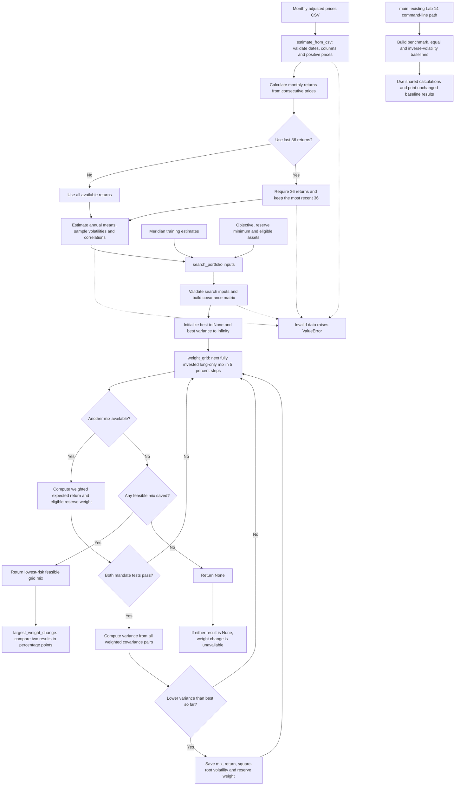

# portfolio.py — engine flowchart

Mermaid source

```mermaid
graph TD
    A["Monthly adjusted prices CSV"] --> B["estimate_from_csv: validate dates, columns and positive prices"]
    B --> C["Calculate monthly returns from consecutive prices"]
    C --> D{"Use last 36 returns?"}
    D -->|No| E["Use all available returns"]
    D -->|Yes| F["Require 36 returns and keep the most recent 36"]
    E --> G["Estimate annual means, sample volatilities and correlations"]
    F --> G
    G --> H["search_portfolio inputs"]
    T["Meridian training estimates"] --> H
    M["Objective, reserve minimum and eligible assets"] --> H
    H --> I["Validate search inputs and build covariance matrix"]
    I --> J["Initialize best to None and best variance to infinity"]
    J --> K["weight_grid: next fully invested long-only mix in 5 percent steps"]
    K --> L{"Another mix available?"}
    L -->|Yes| N["Compute weighted expected return and eligible reserve weight"]
    N --> O{"Both mandate tests pass?"}
    O -->|No| K
    O -->|Yes| P["Compute variance from all weighted covariance pairs"]
    P --> Q{"Lower variance than best so far?"}
    Q -->|No| K
    Q -->|Yes| R["Save mix, return, square-root volatility and reserve weight"]
    R --> K
    L -->|No| S{"Any feasible mix saved?"}
    S -->|Yes| U["Return lowest-risk feasible grid mix"]
    S -->|No| V["Return None"]
    U --> W["largest_weight_change: compare two results in percentage points"]
    V --> X["If either result is None, weight change is unavailable"]
    B -.-> Y["Invalid data raises ValueError"]
    F -.-> Y
    G -.-> Y
    I -.-> Y
    AA["main: existing Lab 14 command-line path"] --> AB["Build benchmark, equal and inverse-volatility baselines"]
    AB --> AC["Use shared calculations and print unchanged baseline results"]
```

