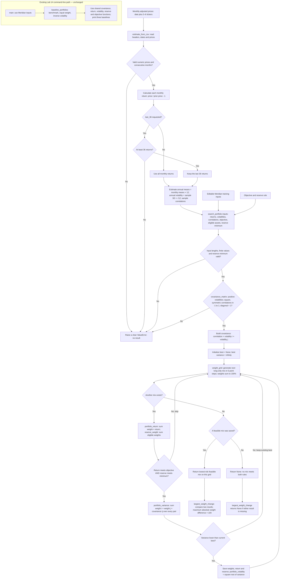

# portfolio.py — engine flowchart

```mermaid
flowchart TD
    CSV["Monthly adjusted prices: date plus 3–6 tickers"] --> READ["estimate_from_csv: read headers, dates and prices"]
    READ --> VALID{"Valid numeric prices and consecutive months?"}
    VALID -->|No| ERR["Raise a clear ValueError; no result"]
    VALID -->|Yes| RET["Calculate each monthly return: price / prior price - 1"]
    RET --> WINDOW{"last_36 requested?"}
    WINDOW -->|No| ALL["Use all monthly returns"]
    WINDOW -->|Yes| ENOUGH{"At least 36 returns?"}
    ENOUGH -->|No| ERR
    ENOUGH -->|Yes| LAST["Keep the last 36 returns"]
    ALL --> EST["Estimate annual means = monthly means × 12; annual volatility = sample SD × √12; sample correlations"]
    LAST --> EST
    EST --> INPUT["search_portfolio inputs: returns, volatilities, correlations, objective, eligible assets, reserve minimum"]
    TRAIN["Editable Meridian training inputs"] --> INPUT
    RULES["Objective and reserve rule"] --> INPUT
    INPUT --> CHECK{"Input lengths, finite values and reserve minimum valid?"}
    CHECK -->|No| ERR
    CHECK -->|Yes| COVCHECK{"covariance_matrix: positive volatilities; square, symmetric correlations in -1 to 1; diagonal = 1?"}
    COVCHECK -->|No| ERR
    COVCHECK -->|Yes| COV["Build covariance: correlation × volatility i × volatility j"]
    COV --> INIT["Initialize best = None; best variance = infinity"]
    INIT --> GRID["weight_grid: generate next long-only mix in 5-point steps; weights sum to 100%"]
    GRID --> MORE{"Another mix exists?"}
    MORE -->|Yes| CALC["portfolio_return: sum weight × return; reserve_weight: sum eligible weights"]
    CALC --> PASS{"Return meets objective AND reserve meets minimum?"}
    PASS -->|No: skip| GRID
    PASS -->|Yes| VAR["portfolio_variance: sum weight i × weight j × covariance ij over every pair"]
    VAR --> LOWER{"Variance lower than current best?"}
    LOWER -->|No: keep existing best| GRID
    LOWER -->|Yes| SAVE["Save weights, return and reserve; portfolio_volatility = square root of variance"]
    SAVE --> GRID
    MORE -->|No| FOUND{"A feasible mix was saved?"}
    FOUND -->|Yes| OUT["Return lowest-risk feasible mix on this grid"]
    FOUND -->|No| NONE["Return None: no mix meets both rules"]
    OUT --> COMP["largest_weight_change: compare two results; maximum absolute weight difference × 100"]
    NONE --> NA["largest_weight_change returns None if either result is missing"]

    subgraph L14["Existing Lab 14 command-line path — unchanged"]
        MAIN["main: use Meridian inputs"] --> BASE["baseline_portfolios: benchmark, equal weight, inverse volatility"]
        BASE --> PRINT["Use shared covariance, return, volatility, reserve and objective functions; print three baselines"]
    end
```
